# Digital Stokvel Banking - Technical Design Document

**Version:** 1.0  
**Status:** Draft  
**Date:** March 2026  
**Based on:** Requirements Specification v1.0

---

## Table of Contents

1. [Executive Summary](#executive-summary)
2. [System Architecture](#system-architecture)
3. [Technology Stack](#technology-stack)
4. [Data Models](#data-models)
5. [API Design](#api-design)
6. [Sequence Diagrams](#sequence-diagrams)
7. [Security Architecture](#security-architecture)
8. [Integration Architecture](#integration-architecture)
9. [Deployment Architecture](#deployment-architecture)
10. [Performance Considerations](#performance-considerations)
11. [Appendices](#appendices)

---

## Executive Summary

This document outlines the technical design for the Digital Stokvel Banking platform, a bank-native feature set that brings South Africa's R50B informal savings economy into the formal banking system. The system supports 11M+ potential users across Android, iOS, USSD, and Web platforms with a 3-month MVP timeline.

### Design Principles

1. **Mobile-First:** Optimize for low-bandwidth, intermittent connectivity
2. **USSD Parity:** Feature phone users are first-class citizens
3. **Security by Design:** POPIA, FICA, and SARB compliance built-in
4. **Scalability:** Support 10K groups in MVP, 100K members by year 1
5. **Cultural Sensitivity:** Language, terminology, and governance reflect stokvel tradition

---

## System Architecture

### High-Level Architecture

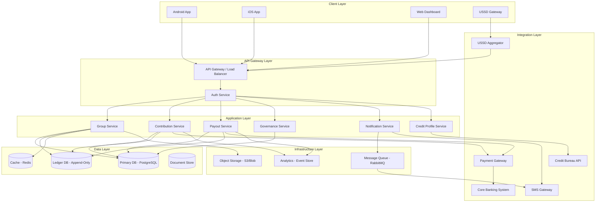

### Component Architecture

#### 1. API Gateway Layer

**Purpose:** Single entry point for all client requests with routing, authentication, rate limiting, and protocol translation.

**Key Responsibilities:**
- Request routing to appropriate microservices
- JWT token validation
- Rate limiting (per user, per group)
- Protocol translation (REST ↔ USSD)
- API versioning
- Request/response logging

**Technology:** Kong API Gateway or Azure API Management

---

#### 2. Application Services

##### Group Service
**Responsibilities:**
- Group creation and management
- Member invitation and onboarding
- Role assignment (Chairperson, Treasurer, Secretary)
- Group constitution management
- Group search and discovery

**Database Tables:** `groups`, `group_members`, `group_roles`, `group_constitution`

---

##### Contribution Service
**Responsibilities:**
- Process member contributions
- Recurring payment management
- Payment reminders
- Contribution ledger updates
- Transaction reconciliation

**Database Tables:** `contributions`, `recurring_payments`, `payment_schedules`

---

##### Payout Service
**Responsibilities:**
- Rotating payout calculation and execution
- Year-end pot distribution
- Dual approval workflow (Chairperson + Treasurer)
- EFT disbursement orchestration
- Payout notifications

**Database Tables:** `payouts`, `payout_approvals`, `payout_schedules`

---

##### Governance Service
**Responsibilities:**
- Voting management
- Dispute resolution workflow
- Missed payment escalation
- Quorum calculation
- Constitution enforcement

**Database Tables:** `votes`, `disputes`, `missed_payments`, `governance_actions`

---

##### Notification Service
**Responsibilities:**
- Multi-channel notification delivery (Push, SMS, USSD)
- Notification templating and localization
- Delivery status tracking
- Retry logic for failed deliveries

**Database Tables:** `notifications`, `notification_templates`, `delivery_logs`

---

##### Credit Profile Service (P1)
**Responsibilities:**
- Stokvel Score calculation
- Credit bureau reporting (with consent)
- Pre-qualification logic
- Contribution streak tracking

**Database Tables:** `credit_profiles`, `credit_bureau_reports`, `stokvel_scores`

---

### USSD Architecture

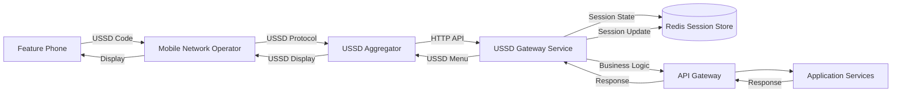

**USSD Session Management:**
- Maximum session timeout: 120 seconds
- Session state persisted in Redis
- Fallback SMS for completed transactions
- Menu depth limited to 3 levels
- PIN authentication via bank's existing system

---

## Technology Stack

### Backend Services

| Component | Technology | Justification |
|-----------|------------|---------------|
| **API Services** | .NET 10 (C#) | High performance, async/await, strong typing, rich ecosystem |
| **Primary Database** | PostgreSQL 15+ | ACID compliance, JSON support, strong consistency |
| **Ledger Database** | PostgreSQL (Append-Only) | Immutable audit trail, time-series optimization |
| **Cache** | Redis 7+ | Sub-millisecond latency, session management |
| **Message Queue** | RabbitMQ / Azure Service Bus | Reliable async processing, retry logic |
| **Object Storage** | Azure Blob Storage / AWS S3 | Document storage (receipts, exports) |
| **Search** | Elasticsearch (optional) | Full-text search for groups, members |

### Frontend Applications

| Platform | Technology | Justification |
|----------|------------|---------------|
| **Android** | Kotlin + Jetpack Compose | Material Design 3, modern UI toolkit |
| **iOS** | Swift + SwiftUI | Native performance, iOS design language |
| **Web** | React + TypeScript | Component reusability, type safety |
| **USSD** | Custom Gateway Service | MNO integration, session management |

### Infrastructure

| Component | Technology |
|-----------|------------|
| **Container Orchestration** | Kubernetes (AKS / EKS) |
| **CI/CD** | GitHub Actions / Azure DevOps |
| **Monitoring** | Prometheus + Grafana |
| **Logging** | ELK Stack (Elasticsearch, Logstash, Kibana) |
| **APM** | New Relic / Azure Application Insights |
| **Secret Management** | HashiCorp Vault / Azure Key Vault |

---

## Data Models

### Entity Relationship Diagram

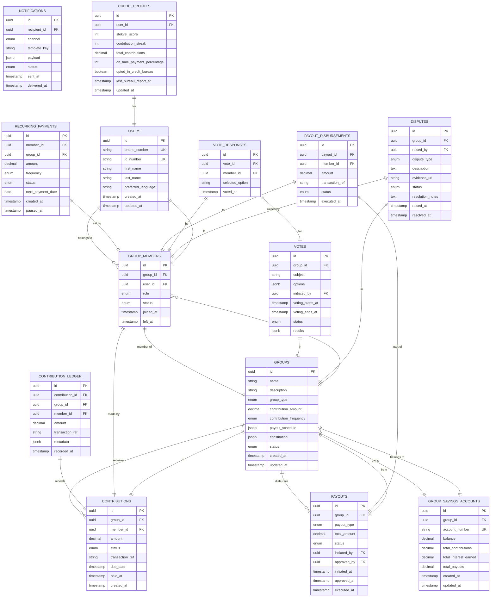

### Key Database Schemas

#### Groups Table

```sql
CREATE TABLE groups (
    id UUID PRIMARY KEY DEFAULT gen_random_uuid(),
    name VARCHAR(50) NOT NULL,
    description VARCHAR(200),
    group_type VARCHAR(20) NOT NULL CHECK (group_type IN ('rotating_payout', 'savings_pot', 'investment_club')),
    contribution_amount DECIMAL(10, 2) NOT NULL CHECK (contribution_amount >= 50 AND contribution_amount <= 10000),
    contribution_frequency VARCHAR(10) NOT NULL CHECK (contribution_frequency IN ('weekly', 'monthly')),
    payout_schedule JSONB NOT NULL,
    constitution JSONB NOT NULL DEFAULT '{}',
    status VARCHAR(20) NOT NULL DEFAULT 'active' CHECK (status IN ('active', 'suspended', 'closed')),
    created_at TIMESTAMP WITH TIME ZONE DEFAULT CURRENT_TIMESTAMP,
    updated_at TIMESTAMP WITH TIME ZONE DEFAULT CURRENT_TIMESTAMP,
    
    CONSTRAINT contribution_amount_positive CHECK (contribution_amount > 0)
);

CREATE INDEX idx_groups_status ON groups(status);
CREATE INDEX idx_groups_created_at ON groups(created_at DESC);
```

#### Contribution Ledger Table (Immutable)

```sql
CREATE TABLE contribution_ledger (
    id UUID PRIMARY KEY DEFAULT gen_random_uuid(),
    contribution_id UUID NOT NULL REFERENCES contributions(id),
    group_id UUID NOT NULL REFERENCES groups(id),
    member_id UUID NOT NULL REFERENCES group_members(id),
    amount DECIMAL(10, 2) NOT NULL,
    transaction_ref VARCHAR(100) NOT NULL,
    metadata JSONB DEFAULT '{}',
    recorded_at TIMESTAMP WITH TIME ZONE DEFAULT CURRENT_TIMESTAMP NOT NULL,
    
    -- Immutability constraint: no updates or deletes allowed
    CONSTRAINT ledger_immutable CHECK (recorded_at <= CURRENT_TIMESTAMP)
);

-- Append-only: no UPDATE or DELETE triggers allowed
CREATE INDEX idx_ledger_group_time ON contribution_ledger(group_id, recorded_at DESC);
CREATE INDEX idx_ledger_member ON contribution_ledger(member_id, recorded_at DESC);
```

#### Group Savings Accounts Table

```sql
CREATE TABLE group_savings_accounts (
    id UUID PRIMARY KEY DEFAULT gen_random_uuid(),
    group_id UUID NOT NULL REFERENCES groups(id) UNIQUE,
    account_number VARCHAR(20) NOT NULL UNIQUE,
    balance DECIMAL(12, 2) NOT NULL DEFAULT 0.00,
    total_contributions DECIMAL(12, 2) NOT NULL DEFAULT 0.00,
    total_interest_earned DECIMAL(12, 2) NOT NULL DEFAULT 0.00,
    total_payouts DECIMAL(12, 2) NOT NULL DEFAULT 0.00,
    interest_rate DECIMAL(5, 2) NOT NULL,
    created_at TIMESTAMP WITH TIME ZONE DEFAULT CURRENT_TIMESTAMP,
    updated_at TIMESTAMP WITH TIME ZONE DEFAULT CURRENT_TIMESTAMP,
    
    CONSTRAINT balance_non_negative CHECK (balance >= 0),
    CONSTRAINT interest_rate_valid CHECK (interest_rate >= 0 AND interest_rate <= 20)
);

CREATE INDEX idx_savings_accounts_balance ON group_savings_accounts(balance DESC);
```

---

## API Design

### RESTful API Endpoints

#### Base URL
```
Production: https://api.stokvel.bank.co.za/v1
Staging: https://api-staging.stokvel.bank.co.za/v1
```

#### Authentication
All API endpoints require JWT Bearer token authentication except public endpoints.

```http
Authorization: Bearer <jwt_token>
X-API-Version: 1.0
X-Language: en|zu|st|xh|af
```

---

### Group Management API

#### Create Group
```http
POST /groups
Content-Type: application/json

Request:
{
  "name": "Ntombizodwa Savings",
  "description": "Year-end savings group",
  "group_type": "savings_pot",
  "contribution_amount": 500.00,
  "contribution_frequency": "monthly",
  "payout_schedule": {
    "type": "year_end",
    "date": "2026-12-15"
  },
  "constitution": {
    "grace_period_days": 3,
    "late_fee": 50.00,
    "missed_payments_threshold": 3,
    "quorum_percentage": 51
  },
  "invited_members": [
    {
      "phone_number": "+27821234567",
      "role": "treasurer"
    },
    {
      "phone_number": "+27829876543",
      "role": "member"
    }
  ]
}

Response: 201 Created
{
  "id": "550e8400-e29b-41d4-a716-446655440000",
  "name": "Ntombizodwa Savings",
  "group_type": "savings_pot",
  "contribution_amount": 500.00,
  "contribution_frequency": "monthly",
  "status": "active",
  "account_number": "4001234567890",
  "member_count": 3,
  "created_at": "2026-03-24T10:30:00Z",
  "invitation_links": [
    {
      "member_id": "...",
      "invite_token": "...",
      "share_link": "https://stokvel.bank.co.za/join/ABC123"
    }
  ]
}
```

#### Get Group Details
```http
GET /groups/{group_id}

Response: 200 OK
{
  "id": "550e8400-e29b-41d4-a716-446655440000",
  "name": "Ntombizodwa Savings",
  "description": "Year-end savings group",
  "group_type": "savings_pot",
  "contribution_amount": 500.00,
  "contribution_frequency": "monthly",
  "status": "active",
  "account": {
    "account_number": "4001234567890",
    "balance": 12500.00,
    "total_contributions": 12000.00,
    "total_interest_earned": 500.00,
    "interest_rate": 4.5
  },
  "member_count": 24,
  "next_contribution_due": "2026-04-01",
  "next_payout": {
    "type": "year_end",
    "date": "2026-12-15",
    "estimated_amount": 15000.00
  },
  "constitution": { ... },
  "created_at": "2025-01-15T10:30:00Z"
}
```

#### List User's Groups
```http
GET /users/me/groups?status=active&page=1&limit=20

Response: 200 OK
{
  "groups": [
    {
      "id": "...",
      "name": "Ntombizodwa Savings",
      "role": "chairperson",
      "balance": 12500.00,
      "member_count": 24,
      "next_contribution_due": "2026-04-01"
    }
  ],
  "pagination": {
    "page": 1,
    "limit": 20,
    "total": 3,
    "pages": 1
  }
}
```

---

### Contribution API

#### Make Contribution
```http
POST /contributions
Content-Type: application/json

Request:
{
  "group_id": "550e8400-e29b-41d4-a716-446655440000",
  "amount": 500.00,
  "payment_method": "linked_account",
  "pin": "encrypted_pin"
}

Response: 201 Created
{
  "id": "...",
  "group_id": "550e8400-e29b-41d4-a716-446655440000",
  "amount": 500.00,
  "transaction_ref": "TXN-2026-03-24-0001",
  "status": "completed",
  "receipt": {
    "receipt_number": "RCP-2026-03-24-0001",
    "date": "2026-03-24T14:30:00Z",
    "group_name": "Ntombizodwa Savings",
    "amount": 500.00,
    "balance_after": 13000.00,
    "pdf_url": "https://cdn.stokvel.bank.co.za/receipts/..."
  },
  "paid_at": "2026-03-24T14:30:00Z"
}
```

#### Get Contribution History
```http
GET /groups/{group_id}/contributions?member_id=&from_date=2026-01-01&to_date=2026-03-31&page=1&limit=50

Response: 200 OK
{
  "contributions": [
    {
      "id": "...",
      "member": {
        "id": "...",
        "name": "Sipho Mkhize",
        "phone": "+27821234567"
      },
      "amount": 500.00,
      "transaction_ref": "TXN-2026-03-24-0001",
      "status": "completed",
      "due_date": "2026-03-01",
      "paid_at": "2026-02-28T10:00:00Z"
    }
  ],
  "summary": {
    "total_contributions": 12000.00,
    "total_members_paid": 24,
    "total_members_pending": 0,
    "total_members_overdue": 0
  },
  "pagination": { ... }
}
```

#### Set Up Recurring Payment
```http
POST /recurring-payments
Content-Type: application/json

Request:
{
  "group_id": "550e8400-e29b-41d4-a716-446655440000",
  "amount": 500.00,
  "frequency": "monthly",
  "start_date": "2026-04-01",
  "mandate_authorization": "digital_signature_token"
}

Response: 201 Created
{
  "id": "...",
  "group_id": "550e8400-e29b-41d4-a716-446655440000",
  "amount": 500.00,
  "frequency": "monthly",
  "status": "active",
  "next_payment_date": "2026-04-01",
  "created_at": "2026-03-24T14:30:00Z"
}
```

---

### Payout API

#### Initiate Payout
```http
POST /payouts
Content-Type: application/json

Request:
{
  "group_id": "550e8400-e29b-41d4-a716-446655440000",
  "payout_type": "rotating",
  "recipient_member_id": "...",
  "amount": 12500.00,
  "note": "March 2026 rotating payout"
}

Response: 201 Created
{
  "id": "...",
  "group_id": "550e8400-e29b-41d4-a716-446655440000",
  "payout_type": "rotating",
  "total_amount": 12500.00,
  "status": "pending_treasurer_approval",
  "initiated_by": {
    "id": "...",
    "name": "Thandi Dlamini",
    "role": "chairperson"
  },
  "initiated_at": "2026-03-24T14:30:00Z",
  "requires_approval_from": "treasurer"
}
```

#### Approve Payout (Treasurer)
```http
POST /payouts/{payout_id}/approve
Content-Type: application/json

Request:
{
  "pin": "encrypted_pin",
  "comment": "Approved - all contributions received"
}

Response: 200 OK
{
  "id": "...",
  "status": "approved",
  "approved_by": {
    "id": "...",
    "name": "Nomsa Zulu",
    "role": "treasurer"
  },
  "approved_at": "2026-03-24T14:45:00Z",
  "execution_status": "processing"
}
```

#### Get Payout Status
```http
GET /payouts/{payout_id}

Response: 200 OK
{
  "id": "...",
  "group_id": "550e8400-e29b-41d4-a716-446655440000",
  "payout_type": "rotating",
  "total_amount": 12500.00,
  "status": "completed",
  "disbursements": [
    {
      "member": {
        "id": "...",
        "name": "Sipho Mkhize"
      },
      "amount": 12500.00,
      "transaction_ref": "PAY-2026-03-24-0001",
      "status": "completed",
      "executed_at": "2026-03-24T14:46:00Z"
    }
  ],
  "initiated_at": "2026-03-24T14:30:00Z",
  "approved_at": "2026-03-24T14:45:00Z",
  "executed_at": "2026-03-24T14:46:00Z"
}
```

---

### Governance API

#### Create Vote
```http
POST /votes
Content-Type: application/json

Request:
{
  "group_id": "550e8400-e29b-41d4-a716-446655440000",
  "subject": "Increase monthly contribution to R600",
  "options": ["approve", "reject"],
  "voting_duration_hours": 48
}

Response: 201 Created
{
  "id": "...",
  "group_id": "550e8400-e29b-41d4-a716-446655440000",
  "subject": "Increase monthly contribution to R600",
  "options": ["approve", "reject"],
  "voting_starts_at": "2026-03-24T14:30:00Z",
  "voting_ends_at": "2026-03-26T14:30:00Z",
  "status": "open",
  "quorum_required": 13,
  "current_votes": 0
}
```

#### Cast Vote
```http
POST /votes/{vote_id}/responses
Content-Type: application/json

Request:
{
  "selected_option": "approve"
}

Response: 201 Created
{
  "id": "...",
  "vote_id": "...",
  "selected_option": "approve",
  "voted_at": "2026-03-24T15:00:00Z"
}
```

#### Raise Dispute
```http
POST /disputes
Content-Type: application/json

Request:
{
  "group_id": "550e8400-e29b-41d4-a716-446655440000",
  "dispute_type": "payment_issue",
  "description": "I made payment on time but it's showing as overdue",
  "evidence": [
    {
      "type": "image",
      "url": "data:image/jpeg;base64,..."
    }
  ]
}

Response: 201 Created
{
  "id": "...",
  "group_id": "550e8400-e29b-41d4-a716-446655440000",
  "dispute_type": "payment_issue",
  "status": "open",
  "raised_at": "2026-03-24T15:00:00Z",
  "resolution_deadline": "2026-04-07T15:00:00Z"
}
```

---

### USSD API Integration

#### USSD Session Endpoint
```http
POST /ussd/session
Content-Type: application/json

Request:
{
  "session_id": "ATUid_123456789",
  "phone_number": "+27821234567",
  "ussd_string": "*120*7878#",
  "user_input": "1",
  "language": "zu"
}

Response: 200 OK
{
  "session_id": "ATUid_123456789",
  "response_type": "CON",
  "message": "Sicela ukhethe iqembu:\n1. Ntombizodwa Savings\n2. Umzingeli Investment\n3. Emuva",
  "session_state": {
    "menu_level": 2,
    "context": {
      "action": "select_group"
    }
  }
}
```

---

## Sequence Diagrams

### 1. Group Creation Flow

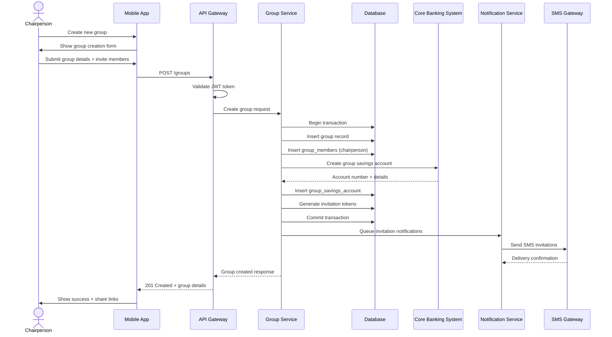

---

### 2. Contribution Payment Flow (Mobile App)

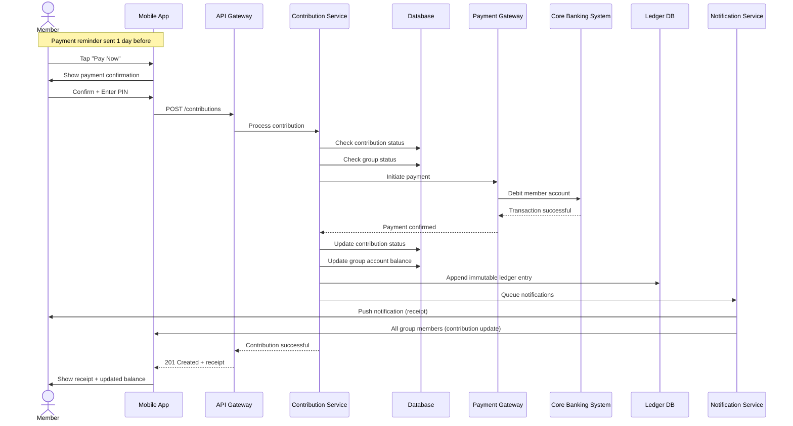

---

### 3. Contribution Payment Flow (USSD)

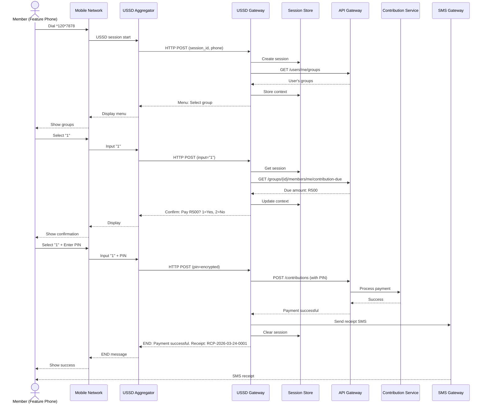

---

### 4. Payout Approval and Disbursement Flow

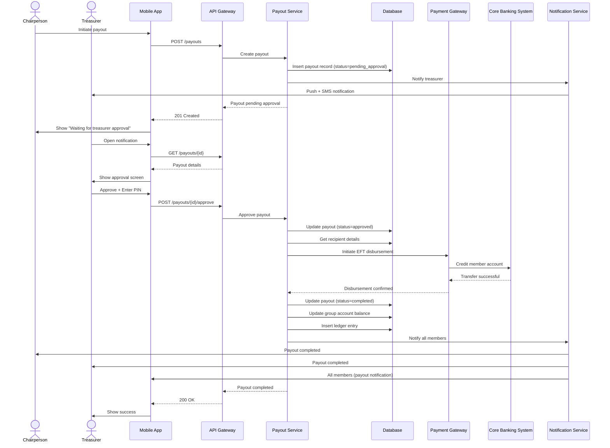

---

### 5. Interest Calculation and Capitalization

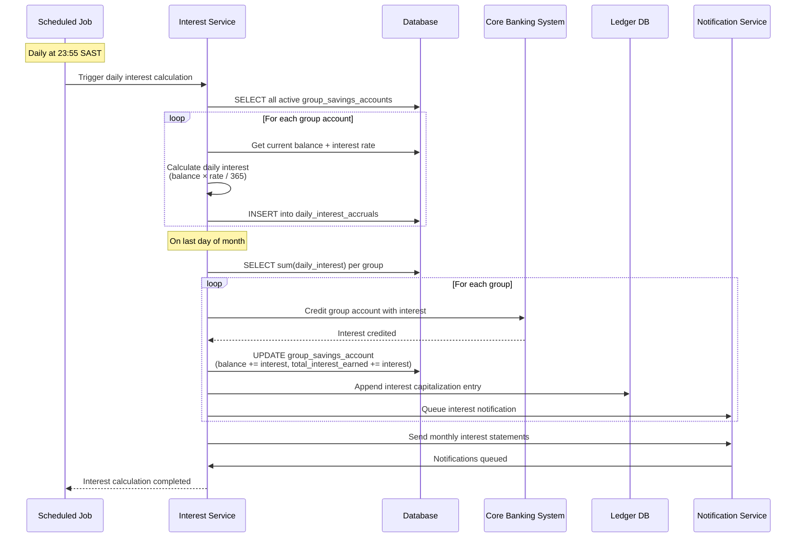

---

### 6. Missed Payment and Escalation Flow

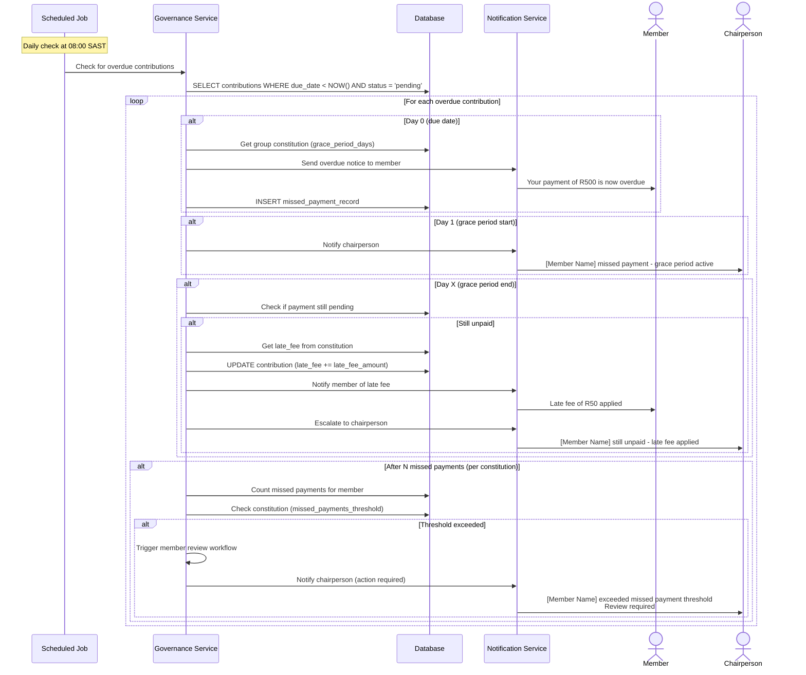

---

### 7. Credit Profile Building and Pre-Qualification Flow (P1)

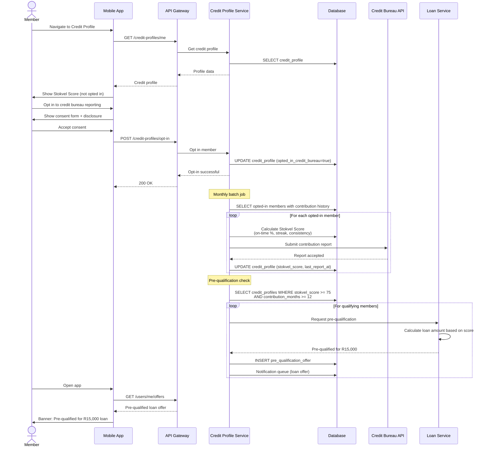

---

## Security Architecture

### Authentication & Authorization

#### JWT Token Structure
```json
{
  "sub": "user_id",
  "phone": "+27821234567",
  "roles": ["member", "chairperson"],
  "groups": ["group_id_1", "group_id_2"],
  "iat": 1711282800,
  "exp": 1711369200,
  "iss": "stokvel-api",
  "aud": "stokvel-clients"
}
```

#### Role-Based Access Control (RBAC)

| Role | Permissions |
|------|-------------|
| **Chairperson** | Create group, invite members, initiate payouts, create votes, access all group data, manage constitution |
| **Treasurer** | Approve payouts, view financial reports, access contribution ledger |
| **Secretary** | View all group activity, export reports, manage member communications |
| **Member** | Make contributions, view own contribution history, vote, raise disputes, view group balance |

#### API Security Measures

1. **Rate Limiting:**
   - Per user: 100 requests/minute
   - Per group: 500 requests/minute
   - USSD sessions: 10 concurrent/user

2. **Input Validation:**
   - JSON schema validation
   - SQL injection prevention (parameterized queries)
   - XSS protection (output encoding)
   - CSRF tokens for web dashboard

3. **Encryption:**
   - TLS 1.3 for all API communication
   - AES-256 for data at rest
   - PINs encrypted with RSA-2048 before transmission
   - Sensitive fields (ID numbers) encrypted in database

4. **Audit Logging:**
   - All financial transactions logged
   - Admin actions logged
   - Failed authentication attempts tracked
   - Retention: 7 years (FICA compliance)

---

### Data Privacy (POPIA Compliance)

#### Personal Data Categories

| Category | Examples | Retention | Encryption |
|----------|----------|-----------|------------|
| **Identity** | ID number, name, surname | Account lifetime + 7 years | Required |
| **Contact** | Phone number, email | Account lifetime | Not required |
| **Financial** | Contributions, payouts | Account lifetime + 7 years | Required |
| **Behavioral** | Login history, device info | 12 months | Not required |
| **Consent** | Credit bureau opt-in | Account lifetime + 7 years | Not required |

#### Data Subject Rights Implementation

1. **Right to Access:** GET /users/me/data-export
2. **Right to Rectification:** PATCH /users/me
3. **Right to Erasure:** DELETE /users/me (pseudonymization for financial records)
4. **Right to Object:** POST /users/me/opt-out
5. **Right to Data Portability:** GET /users/me/data-export?format=json

---

### AML/CFT Monitoring

#### Transaction Monitoring Rules

```csharp
// Rule 1: Large single deposit
if (contribution.Amount > 20000)
    await FlagForReview(contribution);

// Rule 2: High monthly inflow
if (group.MonthlyInflows > 100000)
    await FlagForReview(group);

// Rule 3: Rapid membership growth
if (group.MemberCountIncrease > 50 && group.MemberCountIncreaseWindow <= TimeSpan.FromDays(7))
    await FlagForReview(group);

// Rule 4: Unusual payout pattern
if (payout.FrequencyLast30Days > 4)
    await FlagForReview(payout);

// Rule 5: Churning members
if (member.GroupsJoinedLast30Days > 10)
    await FlagForReview(member);
```

---

## Integration Architecture

### Core Banking System Integration

**Integration Pattern:** Synchronous REST API + Asynchronous Webhooks

#### Account Operations
- Create group savings account
- Credit/debit transactions
- Balance inquiries
- Account statements

#### Payment Operations
- Instant EFT disbursements
- Debit order processing
- Transaction status callbacks

**Error Handling:**
- Retry logic: Exponential backoff (3 attempts)
- Circuit breaker: Open after 5 consecutive failures
- Fallback: Queue transaction for manual processing

---

### Payment Gateway Integration

**Provider:** Bank's existing payment infrastructure

**Supported Methods:**
- Linked bank account (instant)
- Debit order (next business day)
- EFT (same day / instant)

**Webhook Events:**
```json
{
  "event_type": "payment.completed",
  "transaction_ref": "TXN-2026-03-24-0001",
  "amount": 500.00,
  "status": "success",
  "timestamp": "2026-03-24T14:30:00Z",
  "metadata": {
    "contribution_id": "...",
    "group_id": "..."
  }
}
```

---

### SMS Gateway Integration

**Provider:** Twilio / Clickatell / Vodacom Business Messaging

**Message Types:**
1. Payment reminders
2. Payment receipts (USSD fallback)
3. Invitation links
4. Payout notifications
5. Voting alerts
6. Dispute updates

**Rate Limiting:** 10 SMS/user/day (configurable per group)

---

### Credit Bureau Integration (P1)

**Provider:** TransUnion / Experian / Compuscan

**Reporting Frequency:** Monthly batch submission

**Data Submitted:**
```json
{
  "member_id": "...",
  "id_number": "...",
  "reporting_period": "2026-03",
  "contribution_data": {
    "total_contributions": 3000.00,
    "on_time_payments": 12,
    "late_payments": 0,
    "missed_payments": 0,
    "contribution_streak_months": 12,
    "stokvel_score": 85
  }
}
```

---

## Deployment Architecture

### Infrastructure Overview

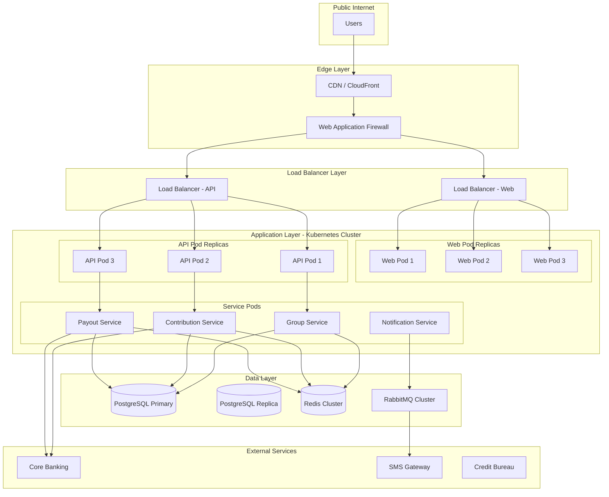

### Environment Configuration

| Environment | Purpose | Infrastructure |
|-------------|---------|----------------|
| **Development** | Local development | Docker Compose |
| **Staging** | Pre-production testing | Single AKS/EKS cluster (3 nodes) |
| **Production** | Live system | Multi-region AKS/EKS (9+ nodes per region) |
| **DR (Disaster Recovery)** | Failover site | Standby cluster in secondary region |

### Kubernetes Resource Specifications

#### API Service Deployment
```yaml
apiVersion: apps/v1
kind: Deployment
metadata:
  name: api-service
spec:
  replicas: 3
  selector:
    matchLabels:
      app: api-service
  template:
    metadata:
      labels:
        app: api-service
    spec:
      containers:
      - name: api
        image: stokvel-api:1.0.0
        resources:
          requests:
            memory: "512Mi"
            cpu: "500m"
          limits:
            memory: "1Gi"
            cpu: "1000m"
        env:
        - name: DATABASE_URL
          valueFrom:
            secretKeyRef:
              name: db-credentials
              key: connection-string
        - name: REDIS_URL
          valueFrom:
            secretKeyRef:
              name: redis-credentials
              key: connection-string
        livenessProbe:
          httpGet:
            path: /health
            port: 8080
          initialDelaySeconds: 30
          periodSeconds: 10
        readinessProbe:
          httpGet:
            path: /ready
            port: 8080
          initialDelaySeconds: 5
          periodSeconds: 5
```

---

### Database Architecture

#### Primary Database (PostgreSQL)
- **Configuration:** Multi-AZ deployment with streaming replication
- **Backup:** Daily full backup + continuous WAL archiving
- **Retention:** 30 days point-in-time recovery
- **Instance Size:** 16 vCPU, 64GB RAM (production)

#### Ledger Database (PostgreSQL Append-Only)
- **Configuration:** Separate instance optimized for write throughput
- **Backup:** Continuous WAL archiving (immutable)
- **Retention:** 7 years (regulatory requirement)
- **Instance Size:** 8 vCPU, 32GB RAM

#### Redis Cache
- **Configuration:** Cluster mode with 3 primary + 3 replica nodes
- **Persistence:** RDB snapshots + AOF
- **Eviction Policy:** LRU for session data, no eviction for USSD sessions
- **Instance Size:** 8GB per node

---

## Performance Considerations

### Scalability Targets

| Metric | MVP (3 months) | Year 1 | Year 3 |
|--------|---------------|--------|--------|
| **Concurrent Users** | 10,000 | 50,000 | 250,000 |
| **API Requests/sec** | 1,000 | 5,000 | 25,000 |
| **Database Size** | 50GB | 500GB | 2TB |
| **Active Groups** | 500 | 10,000 | 100,000 |
| **Daily Transactions** | 5,000 | 100,000 | 1,000,000 |

### Performance Optimization Strategies

#### 1. Caching Strategy

```csharp
// L1 Cache: In-memory (application)
// TTL: 5 minutes
var group = await _memoryCache.GetOrCreateAsync(
    $"group:{groupId}",
    entry => {
        entry.AbsoluteExpirationRelativeToNow = TimeSpan.FromMinutes(5);
        return GetGroupFromL2CacheAsync(groupId);
    });

// L2 Cache: Redis
// TTL: 15 minutes
var cachedGroup = await _distributedCache.GetStringAsync($"group:{groupId}");
if (cachedGroup != null)
    return JsonSerializer.Deserialize<Group>(cachedGroup);

// L3: Database
var group = await _dbContext.Groups
    .Where(g => g.Id == groupId)
    .FirstOrDefaultAsync();
```

**Cache Invalidation:**
- Write-through for critical data (balance, contributions)
- TTL-based for read-heavy data (group details)
- Pub/Sub for real-time updates

---

#### 2. Database Query Optimization

**Slow Query:** List group members with contribution status
```sql
-- Unoptimized (N+1 queries)
SELECT * FROM group_members WHERE group_id = ?;
-- Then for each member:
SELECT * FROM contributions WHERE member_id = ? AND status = 'pending';

-- Optimized (single query with join)
SELECT 
    gm.id,
    gm.user_id,
    u.first_name,
    u.last_name,
    COALESCE(c.status, 'pending') AS contribution_status,
    c.due_date
FROM group_members gm
JOIN users u ON gm.user_id = u.id
LEFT JOIN contributions c ON c.member_id = gm.id 
    AND c.due_date = (SELECT MAX(due_date) FROM contributions WHERE member_id = gm.id)
WHERE gm.group_id = ?
ORDER BY u.last_name;
```

**Index Strategy:**
```sql
-- Composite indexes for common queries
CREATE INDEX idx_contributions_group_status ON contributions(group_id, status, due_date);
CREATE INDEX idx_group_members_user ON group_members(user_id, group_id) WHERE status = 'active';
CREATE INDEX idx_ledger_group_time ON contribution_ledger(group_id, recorded_at DESC);
```

---

#### 3. API Response Optimization

**Pagination:**
```csharp
// Cursor-based pagination for large datasets
[HttpGet("{id}/contributions")]
public async Task<IActionResult> GetContributions(
    Guid id,
    [FromQuery] string? cursor = null,
    [FromQuery] int limit = 50)
{
    DateTime? cursorTime = cursor != null 
        ? DateTime.Parse(Encoding.UTF8.GetString(Convert.FromBase64String(cursor)))
        : null;
    
    var query = _dbContext.Contributions
        .Where(c => c.GroupId == id);
    
    if (cursorTime.HasValue)
        query = query.Where(c => c.CreatedAt < cursorTime.Value);
    
    var contributions = await query
        .OrderByDescending(c => c.CreatedAt)
        .Take(limit + 1)
        .ToListAsync();
    
    var hasMore = contributions.Count > limit;
    var result = contributions.Take(limit).ToList();
    
    return Ok(new {
        contributions = result,
        pagination = new {
            next_cursor = hasMore ? Convert.ToBase64String(
                Encoding.UTF8.GetBytes(result.Last().CreatedAt.ToString("O"))) : null,
            has_more = hasMore
        }
    });
}
```

**Field Selection:**
```csharp
// Client specifies required fields using dynamic projection
[HttpGet("{id}")]
public async Task<IActionResult> GetGroup(
    Guid id,
    [FromQuery] string? fields = null)
{
    var query = _dbContext.Groups.Where(g => g.Id == id);
    
    if (!string.IsNullOrEmpty(fields))
    {
        var fieldList = fields.Split(',');
        // Use dynamic LINQ or AutoMapper projections
        // Reduces payload size by 70%+
    }
    
    var group = await query.FirstOrDefaultAsync();
    return Ok(group);
}
```

---

#### 4. USSD Session Optimization

**Challenge:** 120-second session timeout with high latency networks

**Solutions:**
1. **Pre-fetch common data** during initial menu load
2. **Compress session state** in Redis (use MessagePack)
3. **Fallback to SMS** if session expires during payment
4. **Stateless operations** where possible (balance check)

---

#### 5. Background Job Processing

**Job Types:**
- Interest calculation (daily)
- Payment reminders (daily)
- Credit bureau reporting (monthly)
- Analytics aggregation (hourly)

**Queue Configuration:**
```csharp
// Using Hangfire or Azure Service Bus for background jobs

// Priority queues
public class BackgroundJobService
{
    private readonly IBackgroundJobClient _jobClient;
    
    public async Task QueueJobs()
    {
        // Highest priority - Payment reminders
        _jobClient.Enqueue<PaymentReminderJob>(job => 
            job.SendReminders());
        
        // Medium priority - Interest calculation
        _jobClient.Schedule<InterestCalculationJob>(job => 
            job.CalculateInterest(), TimeSpan.FromHours(1));
        
        // Lowest priority - Analytics
        _jobClient.Schedule<AnalyticsJob>(job => 
            job.AggregateData(), TimeSpan.FromHours(2));
    }
}

// Retry configuration with Polly
public class CreditBureauService
{
    private readonly AsyncRetryPolicy _retryPolicy;
    
    public CreditBureauService()
    {
        _retryPolicy = Policy
            .Handle<HttpRequestException>()
            .WaitAndRetryAsync(
                retryCount: 3,
                sleepDurationProvider: retryAttempt => 
                    TimeSpan.FromMinutes(Math.Pow(2, retryAttempt)), // 1, 2, 4 minutes
                onRetry: (exception, timeSpan, retryCount, context) =>
                {
                    // Log retry attempt
                });
    }
    
    public async Task SubmitReport(CreditReport report)
    {
        await _retryPolicy.ExecuteAsync(async () => 
            await _httpClient.PostAsJsonAsync("/api/reports", report));
    }
}
```

---

## Appendices

### Appendix A: API Error Codes

| Code | HTTP Status | Description | User Message |
|------|-------------|-------------|--------------|
| `AUTH_001` | 401 | Invalid or expired token | Please log in again |
| `AUTH_002` | 403 | Insufficient permissions | You don't have permission to perform this action |
| `GROUP_001` | 404 | Group not found | This group doesn't exist |
| `GROUP_002` | 400 | Invalid contribution amount | Contribution must be between R50 and R10,000 |
| `GROUP_003` | 409 | Duplicate group name | A group with this name already exists |
| `CONTRIBUTION_001` | 400 | Already paid for this period | You've already made your contribution for this month |
| `CONTRIBUTION_002` | 402 | Insufficient balance | You don't have enough funds in your account |
| `PAYOUT_001` | 403 | Approval required | This payout requires treasurer approval |
| `PAYOUT_002` | 400 | Insufficient group balance | The group doesn't have enough funds for this payout |
| `USSD_001` | 408 | Session timeout | Your session expired. Please dial again |
| `SYSTEM_001` | 500 | Internal server error | Something went wrong. Please try again |

---

### Appendix B: Database Migration Strategy

**Tool:** Flyway / Liquibase

**Migration Naming Convention:** `V{version}__{description}.sql`

**Example Migration:**
```sql
-- V001__create_groups_table.sql
CREATE TABLE groups (
    id UUID PRIMARY KEY DEFAULT gen_random_uuid(),
    name VARCHAR(50) NOT NULL,
    created_at TIMESTAMP WITH TIME ZONE DEFAULT CURRENT_TIMESTAMP
);

-- V002__add_group_constitution.sql
ALTER TABLE groups ADD COLUMN constitution JSONB DEFAULT '{}';

-- V003__create_contributions_index.sql
CREATE INDEX idx_contributions_group_status 
ON contributions(group_id, status, due_date);
```

**Rollback Strategy:**
- All migrations must be reversible
- Rollback scripts maintained in separate files
- Blue-green deployment for zero-downtime migrations

---

### Appendix C: Monitoring & Alerting

#### Key Metrics

**System Health:**
- API response time (p50, p95, p99)
- Error rate (4xx, 5xx)
- Database connection pool utilization
- Cache hit ratio
- Queue depth

**Business Metrics:**
- Contributions per hour
- Payout success rate
- USSD session completion rate
- User registration rate
- Active groups

**Alerts:**
```yaml
alerts:
  - name: HighErrorRate
    condition: error_rate > 5%
    duration: 5m
    severity: critical
    notify: pagerduty

  - name: SlowAPIResponse
    condition: p95_response_time > 2s
    duration: 10m
    severity: warning
    notify: slack

  - name: DatabaseConnectionPoolExhaustion
    condition: db_connections > 90%
    duration: 5m
    severity: critical
    notify: pagerduty

  - name: PayoutFailureRate
    condition: payout_failure_rate > 2%
    duration: 15m
    severity: high
    notify: slack, email
```

---

### Appendix D: Development Roadmap

#### Phase 0: Foundation (Weeks 1-2)
- [ ] Infrastructure setup (Kubernetes, databases)
- [ ] CI/CD pipeline
- [ ] Development environment
- [ ] API gateway configuration
- [ ] USSD shortcode registration

#### Phase 1: Core Build (Weeks 3-7)
- [ ] Group Service (FR-01)
- [ ] Contribution Service (FR-03)
- [ ] Payout Service (FR-04)
- [ ] Digital Wallet (FR-02)
- [ ] Governance Service (FR-05)
- [ ] Multilingual support (FR-06)
- [ ] Mobile apps (Android, iOS)
- [ ] USSD gateway
- [ ] Web dashboard (Chairperson)

#### Phase 2: Test & Harden (Weeks 8-10)
- [ ] UAT with 50 pilot groups
- [ ] USSD load testing
- [ ] Security penetration testing
- [ ] POPIA/FICA compliance audit
- [ ] Performance optimization
- [ ] Monitoring & alerting setup

#### Phase 3: MVP Launch (Weeks 11-12)
- [ ] Soft launch to 500 groups
- [ ] Chairperson acquisition campaign
- [ ] Hypercare support (24/7)
- [ ] Real-time monitoring dashboard
- [ ] Incident response procedures

#### Phase 4: Scale (Months 4-6)
- [ ] Credit Profile Builder (FR-07)
- [ ] Financial Wellness Nudges (FR-08)
- [ ] Member referral program
- [ ] Premium tier features
- [ ] Analytics dashboard

---

**Document Status:** Draft  
**Last Updated:** March 2026  
**Next Review:** End of Phase 1 (Week 7)  
**Approved By:** [Pending]

---

## Revision History

| Version | Date | Author | Changes |
|---------|------|--------|---------|
| 1.0 | 2026-03-24 | Technical Team | Initial draft |

---

**END OF DOCUMENT**
