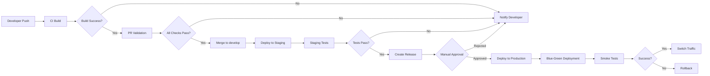

# CI/CD Pipeline Documentation - Digital Stokvel Banking

**Version:** 1.0  
**Last Updated:** March 24, 2026  
**Status:** Active

---

## Overview

This document describes the Continuous Integration and Continuous Deployment (CI/CD) pipelines for the Digital Stokvel Banking platform using GitHub Actions.

### Key Features

- **Automated Builds** - Every push and PR triggers build validation
- **Comprehensive Testing** - Unit tests, code coverage, security scans
- **Code Quality Enforcement** - Style checks, vulnerability scanning
- **Multi-Environment Deployment** - Staging and production with approval gates
- **Blue-Green Deployments** - Zero-downtime production deployments
- **Rollback Capability** - Automated rollback on deployment failure

---

## Table of Contents

1. [Workflow Overview](#workflow-overview)
2. [CI Build Workflow](#ci-build-workflow)
3. [PR Validation Workflow](#pr-validation-workflow)
4. [Deployment Workflows](#deployment-workflows)
5. [Environment Configuration](#environment-configuration)
6. [Security and Secrets](#security-and-secrets)
7. [Docker Image Management](#docker-image-management)
8. [Monitoring and Alerts](#monitoring-and-alerts)
9. [Troubleshooting](#troubleshooting)
10. [Best Practices](#best-practices)

---

## Workflow Overview

### Workflow Triggers

| Workflow | Trigger | Purpose |
|----------|---------|---------|
| **CI Build** | Push to any branch, PR | Validate builds and run tests |
| **PR Validation** | PR opened/updated | Comprehensive PR checks |
| **Deploy Staging** | Push to `develop` | Automatic staging deployment |
| **Deploy Production** | Release published | Production deployment with approval |

### Workflow Diagram



---

## CI Build Workflow

**File:** [`.github/workflows/ci-build.yml`](../.github/workflows/ci-build.yml)

### Purpose

Runs on every push and pull request to validate code quality, build success, and test coverage.

### Jobs

#### 1. Build and Test

```yaml
strategy:
  matrix:
    configuration: [Debug, Release]
```

- **Restores** NuGet packages with caching
- **Builds** solution in both Debug and Release configurations
- **Runs** unit tests with code coverage
- **Uploads** coverage reports to Codecov
- **Artifacts** Release binaries for deployment

**Key Features:**
- Parallel builds (Debug + Release)
- NuGet package caching for faster builds
- Code coverage collection with XPlat Code Coverage
- Build artifacts uploaded for main branch commits

#### 2. Code Quality Analysis

- **Code analysis** with .NET analyzers
- **Vulnerability scanning** for NuGet packages
- **Deprecated package detection**
- **Security warnings** surfaced in PR comments

#### 3. Security Scan

- **Trivy scanner** for filesystem vulnerability detection
- **SARIF upload** to GitHub Security tab
- **Automated security alerts** on detection

#### 4. Docker Build Verification

- **Multi-service builds** (8 services + gateways)
- **Buildx** for optimized Docker builds
- **Cache layers** to speed up builds
- **Platform-specific** builds (linux/amd64)

**Services:**
- GroupService
- ContributionService
- PayoutService
- GovernanceService
- NotificationService
- CreditProfileService
- UssdGateway
- ApiGateway

---

## PR Validation Workflow

**File:** [`.github/workflows/pr-validation.yml`](../.github/workflows/pr-validation.yml)

### Purpose

Comprehensive validation of pull requests before merging, ensuring code quality and security standards.

### Jobs

#### 1. PR Information

Displays PR metadata in GitHub Actions summary:
- Title, author, source/target branches
- Files changed, additions, deletions

#### 2. Validation

**PR Title Format:**
- Enforces [Conventional Commits](https://www.conventionalcommits.org/) format
- Examples: `feat: add feature`, `fix: bug fix`, `docs: update docs`

**Merge Conflict Detection:**
- Checks for merge conflicts with target branch
- Fails PR if conflicts detected

#### 3. Build and Test

- Full solution build (Release configuration)
- Unit test execution with coverage
- Coverage report generation with ReportGenerator
- Coverage summary in PR comments

#### 4. Code Style Check

- **dotnet format** verification
- Enforces consistent code formatting
- Fails if formatting issues detected

**Fix locally:**
```bash
dotnet format
```

#### 5. Security Check

- **Vulnerable package detection**
- **TruffleHog** secret scanning
- Prevents accidental credential commits

#### 6. PR Size Check

- Analyzes PR size (files changed, line changes)
- Warns if PR is too large (>1000 lines)
- Encourages smaller, focused PRs

#### 7. Auto-Labeling

Uses [`.github/labeler.yml`](../.github/labeler.yml) to automatically label PRs based on changed files:
- Service labels: `service: group`, `service: contribution`
- Component labels: `shared: common`, `gateway: api`
- Type labels: `documentation`, `ci/cd`, `tests`

---

## Deployment Workflows

### Staging Deployment

**File:** [`.github/workflows/deploy-staging.yml`](../.github/workflows/deploy-staging.yml)

**Trigger:** Push to `develop` branch

**Process:**
1. **Build** Docker images for all services
2. **Push** to Azure Container Registry (ACR)
3. **Deploy** to staging AKS cluster
4. **Run** smoke tests
5. **Notify** team of deployment status

**Environment:**
- **URL:** https://api-staging.stokvel.bank.co.za
- **Namespace:** `digitalstokvel-staging`
- **Approval:** Not required (automatic)

### Production Deployment

**File:** [`.github/workflows/deploy-production.yml`](../.github/workflows/deploy-production.yml)

**Trigger:** Release published or manual workflow dispatch

**Process:**
1. **Pre-Deployment Checks**
   - Version validation (semantic versioning)
   - Required secrets verification
   - Manual approval gate

2. **Build and Push**
   - Build production Docker images
   - Tag with version: `v1.0.0`, `1.0`, `production-latest`
   - Push to ACR

3. **Blue-Green Deployment**
   - Deploy to "green" environment (new version)
   - Run comprehensive smoke tests
   - Switch traffic to green (zero-downtime)
   - Monitor for 5 minutes
   - Scale down blue (old version) after success

4. **Post-Deployment**
   - Integration tests
   - Team notification
   - Documentation update

5. **Rollback (if needed)**
   - Automatic rollback on failure
   - Switch traffic back to blue
   - Scale down failed green deployment

**Environment:**
- **URL:** https://api.stokvel.bank.co.za
- **Namespace:** `digitalstokvel-production`
- **Approval:** Required (via GitHub Environments)

---

## Environment Configuration

### GitHub Environments

Configure these environments in GitHub repository settings:

#### Staging Environment

**Protection Rules:**
- None (automatic deployment)

**Secrets:**
- `AZURE_CREDENTIALS_STAGING`
- `STAGING_RESOURCE_GROUP`
- `STAGING_CLUSTER_NAME`

#### Production Environment

**Protection Rules:**
- **Required reviewers:** 2 approvers (Product Owner + Tech Lead)
- **Wait timer:** 5 minutes (sanity check)
- **Branch restrictions:** Only `main` branch

**Secrets:**
- `AZURE_CREDENTIALS_PRODUCTION`
- `PRODUCTION_RESOURCE_GROUP`
- `PRODUCTION_CLUSTER_NAME`

### Environment Variables

Set these in GitHub repository Settings → Secrets and Variables → Actions:

| Secret | Description | Example |
|--------|-------------|---------|
| `REGISTRY_USERNAME` | Container registry username | `digitalstokvel` |
| `REGISTRY_PASSWORD` | Container registry password/token | `****` |
| `AZURE_CREDENTIALS_STAGING` | Azure service principal for staging | JSON credentials |
| `AZURE_CREDENTIALS_PRODUCTION` | Azure service principal for production | JSON credentials |
| `STAGING_RESOURCE_GROUP` | Azure resource group for staging | `rg-stokvel-staging` |
| `STAGING_CLUSTER_NAME` | AKS cluster name for staging | `aks-stokvel-staging` |
| `PRODUCTION_RESOURCE_GROUP` | Azure resource group for production | `rg-stokvel-prod` |
| `PRODUCTION_CLUSTER_NAME` | AKS cluster name for production | `aks-stokvel-prod` |
| `CODECOV_TOKEN` | Codecov upload token (optional) | `****` |

---

## Security and Secrets

### Azure Service Principal

Create service principals for deployment:

```bash
# Staging
az ad sp create-for-rbac --name "github-actions-staging" \
  --role contributor \
  --scopes /subscriptions/{subscription-id}/resourceGroups/rg-stokvel-staging \
  --sdk-auth

# Production
az ad sp create-for-rbac --name "github-actions-production" \
  --role contributor \
  --scopes /subscriptions/{subscription-id}/resourceGroups/rg-stokvel-prod \
  --sdk-auth
```

Store the JSON output as `AZURE_CREDENTIALS_STAGING` and `AZURE_CREDENTIALS_PRODUCTION`.

### Container Registry Access

```bash
# Get ACR credentials
az acr credential show --name digitalstokvel

# Store username and password as secrets
# REGISTRY_USERNAME: digitalstokvel
# REGISTRY_PASSWORD: <password from above>
```

### Secret Scanning

- **TruffleHog** runs on every PR to detect leaked secrets
- **GitHub Secret Scanning** automatically detects known patterns
- **Best Practice:** Never commit secrets; use Azure Key Vault

---

## Docker Image Management

### Image Tagging Strategy

#### Staging Images

- `staging-latest` - Latest staging deployment
- `develop-{sha}` - Specific commit SHA
- `develop` - Branch name

**Example:**
```
digitalstokvel.azurecr.io/digitalstokvel-groupservice:staging-latest
digitalstokvel.azurecr.io/digitalstokvel-groupservice:develop-abc1234
```

#### Production Images

- `production-latest` - Latest production deployment
- `v1.0.0` - Semantic version (from release tag)
- `1.0` - Major.minor version
- `1` - Major version only

**Example:**
```
digitalstokvel.azurecr.io/digitalstokvel-groupservice:production-latest
digitalstokvel.azurecr.io/digitalstokvel-groupservice:v1.2.3
digitalstokvel.azurecr.io/digitalstokvel-groupservice:1.2
digitalstokvel.azurecr.io/digitalstokvel-groupservice:1
```

### Image Retention

- **Staging:** 30 days
- **Production:** 90 days
- **Tagged releases:** Indefinite

---

## Monitoring and Alerts

### Build Status Badges

Add to README.md:

```markdown
[](https://github.com/org/digital-stokvel/actions/workflows/ci-build.yml)
[](https://github.com/org/digital-stokvel/actions/workflows/deploy-staging.yml)
```

### Notification Integration

Configure Slack/Teams notifications (placeholder in workflows):

```yaml
- name: Send notification
  run: |
    # Send to Slack
    curl -X POST ${{ secrets.SLACK_WEBHOOK_URL }} \
      -H 'Content-Type: application/json' \
      -d '{"text":"Deployment successful!"}'
```

### Monitoring Dashboards

- **GitHub Actions:** Built-in workflow runs and logs
- **Azure Monitor:** AKS cluster health and metrics
- **Application Insights:** Service performance (see [LOGGING_STANDARDS.md](./LOGGING_STANDARDS.md))

---

## Troubleshooting

### Common Issues

#### 1. Build Fails with NuGet Restore Error

**Symptom:** `dotnet restore` fails

**Solution:**
- Check NuGet.org connectivity
- Verify package versions in `.csproj` files
- Clear NuGet cache: `dotnet nuget locals all --clear`

#### 2. Docker Build Fails

**Symptom:** Docker build step fails

**Solution:**
- Verify Dockerfile exists in service directory
- Check Docker context path
- Ensure base images are available

#### 3. Deployment Hangs

**Symptom:** AKS deployment does not complete

**Solution:**
- Check AKS cluster health
- Verify service principal permissions
- Review kubectl logs: `kubectl logs -f deployment/service-name`

#### 4. PR Validation Fails on Title Format

**Symptom:** "PR title must follow Conventional Commits format"

**Solution:**
Update PR title to match format:
```
feat: add new feature
fix: resolve bug
docs: update documentation
chore: update dependencies
```

#### 5. Security Scan Detects Vulnerable Packages

**Symptom:** Vulnerable package detected in security scan

**Solution:**
- Update vulnerable package: `dotnet add package PackageName --version X.X.X`
- Check for transitive dependencies
- Update to latest stable version

---

## Best Practices

### For Developers

1. **Commit Frequently**
   - Small, focused commits
   - Clear commit messages (Conventional Commits)

2. **Run Locally First**
   ```bash
   dotnet restore
   dotnet build
   dotnet test
   dotnet format
   ```

3. **Keep PRs Small**
   - < 500 lines changed ideal
   - Single feature or bug fix per PR
   - Easier for reviewers

4. **Write Tests**
   - Unit tests for all new code
   - Aim for 80%+ code coverage
   - Test edge cases

5. **Review Build Logs**
   - Check GitHub Actions summary
   - Fix warnings, not just errors

### For Reviewers

1. **Use GitHub Code Review**
   - Comment on specific lines
   - Request changes if needed
   - Approve when ready

2. **Check CI Status**
   - All checks must pass
   - Review code coverage report
   - Verify no security issues

3. **Verify Testing**
   - Tests exist for new features
   - Tests cover edge cases
   - Tests are meaningful

### For Deployers

1. **Staging First**
   - Always deploy to staging before production
   - Run manual tests on staging
   - Monitor for 24 hours

2. **Production Deployments**
   - Schedule during low-traffic periods
   - Have rollback plan ready
   - Monitor for 30 minutes post-deployment

3. **Communication**
   - Notify team before production deploy
   - Document changes in release notes
   - Post-mortem for failed deployments

---

## GitHub Actions Workflow Examples

### Trigger CI Build Manually

```bash
gh workflow run ci-build.yml
```

### Trigger Staging Deployment

```bash
gh workflow run deploy-staging.yml
```

### Trigger Production Deployment

```bash
gh workflow run deploy-production.yml -f version=v1.0.0
```

### View Workflow Runs

```bash
# List recent runs
gh run list --workflow=ci-build.yml

# View specific run
gh run view <run-id>

# Watch run in real-time
gh run watch <run-id>
```

---

## Release Process

### Creating a Release

1. **Merge to main**
   ```bash
   git checkout main
   git merge develop
   git push origin main
   ```

2. **Create Git tag**
   ```bash
   git tag -a v1.0.0 -m "Release version 1.0.0"
   git push origin v1.0.0
   ```

3. **Create GitHub Release**
   - Go to GitHub → Releases → Draft a new release
   - Select tag: `v1.0.0`
   - Title: `Digital Stokvel v1.0.0`
   - Description: Release notes
   - Publish release

4. **Approve Production Deployment**
   - GitHub Actions workflow triggered automatically
   - Navigate to Actions → Deploy to Production
   - Click "Review deployments"
   - Approve deployment

5. **Monitor Production**
   - Watch deployment logs
   - Monitor Application Insights
   - Check error rates and performance

---

## Rollback Procedures

### Automatic Rollback

If deployment fails during smoke tests, automatic rollback occurs:
- Traffic switches back to blue (old version)
- Failed green deployment scaled down
- Notification sent to team

### Manual Rollback

If issues detected after deployment:

1. **Trigger rollback workflow**
   ```bash
   gh workflow run deploy-production.yml --ref rollback
   ```

2. **Or manually via kubectl**
   ```bash
   # Switch traffic back
   kubectl patch service api-gateway -n digitalstokvel-production \
     -p '{"spec":{"selector":{"version":"blue"}}}'
   
   # Scale up old version
   kubectl scale deployment --replicas=3 -l version=blue -n digitalstokvel-production
   
   # Scale down new version
   kubectl scale deployment --replicas=0 -l version=green -n digitalstokvel-production
   ```

3. **Verify rollback**
   ```bash
   kubectl get pods -n digitalstokvel-production
   curl https://api.stokvel.bank.co.za/health
   ```

---

## Continuous Improvement

### Metrics to Track

- **Build Success Rate:** Target > 95%
- **Average Build Time:** Target < 10 minutes
- **Test Coverage:** Target > 80%
- **Deployment Frequency:** Target 2-3x/week (staging)
- **Mean Time to Recovery (MTTR):** Target < 30 minutes
- **Change Failure Rate:** Target < 5%

### Planned Improvements

- [ ] Add performance benchmarking
- [ ] Implement automated canary deployments
- [ ] Add automated load testing in staging
- [ ] Integrate with PagerDuty for alerts
- [ ] Add deployment metrics dashboard
- [ ] Implement feature flags

---

## References

- [GitHub Actions Documentation](https://docs.github.com/en/actions)
- [Azure Kubernetes Service (AKS)](https://docs.microsoft.com/en-us/azure/aks/)
- [Docker Best Practices](https://docs.docker.com/develop/dev-best-practices/)
- [Conventional Commits](https://www.conventionalcommits.org/)
- [Semantic Versioning](https://semver.org/)
- [Blue-Green Deployments](https://martinfowler.com/bliki/BlueGreenDeployment.html)

---

**Document Status:** Active  
**Last Updated:** March 24, 2026  
**Next Review:** April 2026
