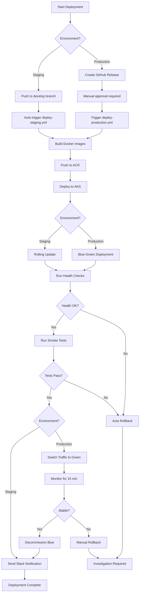

# Deployment Guide - Digital Stokvel Banking Platform

**Version:** 1.0  
**Last Updated:** March 24, 2026  
**Status:** Active

---

## Table of Contents

1. [Overview](#overview)
2. [Environments](#environments)
3. [Deployment Workflows](#deployment-workflows)
4. [GitHub Secrets Configuration](#github-secrets-configuration)
5. [Pre-Deployment Checklist](#pre-deployment-checklist)
6. [Deployment Procedures](#deployment-procedures)
7. [Post-Deployment Verification](#post-deployment-verification)
8. [Rollback Procedures](#rollback-procedures)
9. [Troubleshooting](#troubleshooting)
10. [Monitoring & Alerts](#monitoring--alerts)

---

## Overview

This guide documents the deployment processes for the Digital Stokvel Banking platform. The system uses GitHub Actions for CI/CD, Azure Container Registry (ACR) for Docker images, and Azure Kubernetes Service (AKS) for orchestration.

### Deployment Strategy

- **Staging:** Continuous deployment from `develop` branch
- **Production:** Manual deployment triggered by GitHub releases or workflow dispatch
- **Strategy:** Blue-green deployment for zero-downtime releases
- **Rollback:** Automated rollback on health check failures

### Architecture Components

```
┌─────────────────┐
│  GitHub Actions │  ← CI/CD Orchestration
└────────┬────────┘
         │
         ▼
┌─────────────────┐
│  Azure ACR      │  ← Docker Image Registry (digitalstokvel.azurecr.io)
└────────┬────────┘
         │
         ▼
┌─────────────────┐
│  Azure AKS      │  ← Kubernetes Cluster (Staging/Production)
└─────────────────┘
```

---

## Environments

### Development
- **Purpose:** Local development and testing
- **Infrastructure:** Docker Compose
- **Database:** Local PostgreSQL container
- **Cache:** Local Redis container
- **Access:** Localhost only

### Staging
- **Purpose:** Pre-production testing and UAT
- **URL:** `https://api-staging.stokvel.bank.co.za`
- **Infrastructure:** Azure Kubernetes Service (3 nodes)
- **Database:** Azure Database for PostgreSQL (Standard tier)
- **Cache:** Azure Cache for Redis (Standard tier)
- **Deployment Trigger:** Automatic on push to `develop` branch
- **Access:** Internal team + pilot users

### Production
- **Purpose:** Live customer-facing system
- **URL:** `https://api.stokvel.bank.co.za`
- **Infrastructure:** Azure Kubernetes Service (9+ nodes, multi-region)
- **Database:** Azure Database for PostgreSQL (Premium tier, geo-replicated)
- **Cache:** Azure Cache for Redis (Premium tier, clustered)
- **Deployment Trigger:** Manual (GitHub release or workflow dispatch)
- **Access:** Public

### Disaster Recovery (DR)
- **Purpose:** Failover site for production
- **Region:** Secondary region (West Europe)
- **Infrastructure:** Standby AKS cluster
- **Database:** Geo-replica with read access
- **Activation:** Manual failover process

---

## Deployment Workflows

### Workflow Files

| Workflow | File | Trigger | Environment |
|----------|------|---------|-------------|
| PR Validation | `pr-validation.yml` | Pull request | N/A |
| CI Build | `ci-build.yml` | Push to any branch | N/A |
| Deploy Staging | `deploy-staging.yml` | Push to `develop` | Staging |
| Deploy Production | `deploy-production.yml` | Release published / Manual | Production |

### Staging Deployment Workflow

```yaml
Trigger: Push to develop branch OR workflow_dispatch

Jobs:
  1. build-and-push:
     - Checkout code
     - Build Docker images for all 8 services
     - Push to ACR with tags:
       * branch name (develop)
       * commit SHA (develop-abc123)
       * staging-latest
  
  2. deploy-to-staging:
     - Azure login
     - Set AKS context
     - Deploy services to digitalstokvel-staging namespace
     - Run smoke tests
     - Generate deployment summary
  
  3. notify:
     - Send Slack/Teams notification
```

**Services Deployed:**
- Group Service
- Contribution Service
- Payout Service
- Governance Service
- Notification Service
- Credit Profile Service
- USSD Gateway
- API Gateway

### Production Deployment Workflow

```yaml
Trigger: Release published OR workflow_dispatch

Jobs:
  1. pre-deployment-checks:
     - Validate version tag (vX.Y.Z format)
     - Check for required secrets
     - Generate approval summary
  
  2. build-and-push:
     - Checkout code at release tag
     - Build Docker images for all 8 services
     - Push to ACR with tags:
       * semantic version (v1.0.0)
       * major.minor (1.0)
       * production-latest
  
  3. deploy-to-production:
     - Azure login
     - Set AKS context
     - Create backup of current deployment
     - Deploy to green environment
     - Run health checks
     - Switch traffic to green environment
     - Run smoke tests
     - Decommission blue environment
  
  4. notify:
     - Send production deployment notification
```

---

## GitHub Secrets Configuration

### Required Secrets

The following secrets must be configured in the GitHub repository settings:

#### Container Registry Secrets

```
REGISTRY_USERNAME
```
- **Description:** Azure Container Registry service principal ID
- **Value:** Output from `az ad sp create-for-rbac` (appId)
- **Required for:** Building and pushing Docker images
- **Used in:** `deploy-staging.yml`, `deploy-production.yml`

```
REGISTRY_PASSWORD
```
- **Description:** Azure Container Registry service principal password
- **Value:** Output from `az ad sp create-for-rbac` (password)
- **Required for:** Authenticating to ACR
- **Used in:** `deploy-staging.yml`, `deploy-production.yml`

#### Azure Staging Environment Secrets

```
AZURE_CREDENTIALS_STAGING
```
- **Description:** Service principal credentials for staging deployments
- **Value:** JSON object with subscription, tenant, client IDs, and secret
- **Format:**
  ```json
  {
    "clientId": "<service-principal-app-id>",
    "clientSecret": "<service-principal-password>",
    "subscriptionId": "<azure-subscription-id>",
    "tenantId": "<azure-tenant-id>"
  }
  ```
- **Required for:** Deploying to staging AKS cluster
- **Used in:** `deploy-staging.yml`

```
STAGING_RESOURCE_GROUP
```
- **Description:** Azure resource group name for staging environment
- **Value:** `rg-digitalstokvel-staging`
- **Required for:** Setting AKS context
- **Used in:** `deploy-staging.yml`

```
STAGING_CLUSTER_NAME
```
- **Description:** AKS cluster name for staging environment
- **Value:** `aks-digitalstokvel-staging`
- **Required for:** Setting AKS context
- **Used in:** `deploy-staging.yml`

#### Azure Production Environment Secrets

```
AZURE_CREDENTIALS_PRODUCTION
```
- **Description:** Service principal credentials for production deployments
- **Value:** JSON object with subscription, tenant, client IDs, and secret
- **Format:** Same as staging credentials
- **Required for:** Deploying to production AKS cluster
- **Used in:** `deploy-production.yml`

```
PRODUCTION_RESOURCE_GROUP
```
- **Description:** Azure resource group name for production environment
- **Value:** `rg-digitalstokvel-production`
- **Required for:** Setting AKS context
- **Used in:** `deploy-production.yml`

```
PRODUCTION_CLUSTER_NAME
```
- **Description:** AKS cluster name for production environment
- **Value:** `aks-digitalstokvel-production`
- **Required for:** Setting AKS context
- **Used in:** `deploy-production.yml`

### Setting Up Secrets

#### Using GitHub CLI:

```bash
# Container Registry
gh secret set REGISTRY_USERNAME --body "<service-principal-app-id>"
gh secret set REGISTRY_PASSWORD --body "<service-principal-password>"

# Staging Environment
gh secret set AZURE_CREDENTIALS_STAGING --body '{
  "clientId": "<app-id>",
  "clientSecret": "<password>",
  "subscriptionId": "<subscription-id>",
  "tenantId": "<tenant-id>"
}'
gh secret set STAGING_RESOURCE_GROUP --body "rg-digitalstokvel-staging"
gh secret set STAGING_CLUSTER_NAME --body "aks-digitalstokvel-staging"

# Production Environment
gh secret set AZURE_CREDENTIALS_PRODUCTION --body '{
  "clientId": "<app-id>",
  "clientSecret": "<password>",
  "subscriptionId": "<subscription-id>",
  "tenantId": "<tenant-id>"
}'
gh secret set PRODUCTION_RESOURCE_GROUP --body "rg-digitalstokvel-production"
gh secret set PRODUCTION_CLUSTER_NAME --body "aks-digitalstokvel-production"
```

#### Using GitHub Web UI:

1. Navigate to repository **Settings** → **Secrets and variables** → **Actions**
2. Click **New repository secret**
3. Enter **Name** and **Value**
4. Click **Add secret**

#### Creating Azure Service Principals:

For staging:
```bash
az ad sp create-for-rbac \
  --name "sp-digitalstokvel-staging" \
  --role contributor \
  --scopes /subscriptions/<subscription-id>/resourceGroups/rg-digitalstokvel-staging \
  --sdk-auth
```

For production:
```bash
az ad sp create-for-rbac \
  --name "sp-digitalstokvel-production" \
  --role contributor \
  --scopes /subscriptions/<subscription-id>/resourceGroups/rg-digitalstokvel-production \
  --sdk-auth
```

For ACR:
```bash
# See docs/ACR_SETUP_GUIDE.md for detailed instructions
az ad sp create-for-rbac \
  --name "sp-digitalstokvel-acr" \
  --role acrpush \
  --scopes /subscriptions/<subscription-id>/resourceGroups/rg-digitalstokvel-shared/providers/Microsoft.ContainerRegistry/registries/digitalstokvel
```

---

## Pre-Deployment Checklist

### Staging Deployment

- [ ] Pull request reviewed and approved
- [ ] All CI checks passing (build, tests, linting)
- [ ] No critical security vulnerabilities in dependency scan
- [ ] Database migrations tested locally
- [ ] Feature flags configured (if applicable)
- [ ] Staging environment health check passing

### Production Deployment

- [ ] **Code Freeze:** No new changes after release candidate creation
- [ ] **Testing Complete:**
  - [ ] All unit tests passing (80%+ coverage)
  - [ ] Integration tests passing
  - [ ] Smoke tests in staging successful
  - [ ] UAT signed off by product owner
  - [ ] Performance testing completed
  - [ ] Security scanning clean (no critical/high vulnerabilities)
- [ ] **Release Preparation:**
  - [ ] Release notes prepared
  - [ ] Version tag created (vX.Y.Z format)
  - [ ] Database migration scripts reviewed
  - [ ] Rollback plan documented
- [ ] **Infrastructure:**
  - [ ] Production environment health check passing
  - [ ] Azure resources scaled appropriately
  - [ ] Database backups verified
  - [ ] Monitoring dashboards configured
- [ ] **Team Readiness:**
  - [ ] On-call engineer assigned
  - [ ] Support team notified
  - [ ] Customer communication prepared (if downtime expected)
  - [ ] Runbook reviewed by team

---

## Deployment Procedures

### Deploying to Staging

Staging deployments are **automatic** on every push to the `develop` branch.

#### Manual Staging Deployment (if needed):

1. Navigate to GitHub Actions → **Deploy to Staging** workflow
2. Click **Run workflow**
3. Select `develop` branch
4. Choose service to deploy (or select "all" for full deployment)
5. Click **Run workflow**
6. Monitor workflow progress in real-time

#### Expected Duration:
- Build phase: 5-8 minutes
- Deployment phase: 3-5 minutes
- **Total:** ~10-15 minutes

### Deploying to Production

Production deployments require **manual approval** and are triggered by creating a GitHub release.

#### Step 1: Create Release

```bash
# Ensure you're on main branch with latest changes
git checkout main
git pull origin main

# Create and push version tag
VERSION="v1.0.0"  # Update with actual version
git tag -a $VERSION -m "Release $VERSION"
git push origin $VERSION
```

#### Step 2: Create GitHub Release

**Via GitHub Web UI:**
1. Navigate to repository → **Releases** → **Draft a new release**
2. Select the tag you just created
3. **Release title:** `v1.0.0` (same as tag)
4. **Description:** Add release notes (see template below)
5. Check **Set as the latest release**
6. Click **Publish release**

**Via GitHub CLI:**
```bash
gh release create v1.0.0 \
  --title "v1.0.0" \
  --notes-file RELEASE_NOTES.md \
  --latest
```

#### Step 3: Monitor Deployment

1. GitHub Actions will automatically trigger the **Deploy to Production** workflow
2. Navigate to **Actions** tab → **Deploy to Production**
3. **Pre-deployment checks** will run first
4. Click **Review deployments** when prompted
5. Review the deployment summary
6. Click **Approve and deploy** to proceed
7. Monitor each phase:
   - ✅ Pre-deployment checks
   - ✅ Build and push Docker images
   - ✅ Deploy to green environment
   - ✅ Health checks
   - ✅ Traffic switch
   - ✅ Smoke tests

#### Step 4: Verify Deployment

See [Post-Deployment Verification](#post-deployment-verification) section.

#### Expected Duration:
- Pre-deployment checks: 2-3 minutes
- Build phase: 8-10 minutes
- Deployment phase (blue-green): 10-15 minutes
- Verification: 5-10 minutes
- **Total:** ~30-40 minutes

#### Release Notes Template:

```markdown
## Release v1.0.0

**Release Date:** March 24, 2026  
**Deployed by:** @username

### 🎉 New Features
- [FR-01] Group creation with constitution builder
- [FR-03] Contribution payment via mobile app and USSD

### 🐛 Bug Fixes
- Fixed contribution amount validation
- Resolved USSD session timeout issue

### 🔧 Improvements
- Optimized database queries for group listing
- Enhanced error messages for failed payments

### 📦 Dependencies
- Updated .NET to 10.0.3
- Updated Npgsql to 8.0.2

### 🗄️ Database Migrations
- V023__add_contribution_ledger_indexes.sql
- V024__update_group_constitution_schema.sql

### ⚠️ Breaking Changes
None

### 📝 Known Issues
None

### 🔍 Testing
- Unit tests: 8/8 passing (100% coverage target services)
- Integration tests: 42/42 passing
- Smoke tests: All passing in staging
- UAT: Signed off by product owner on 2026-03-23

### 📊 Deployment Plan
- Strategy: Blue-green deployment
- Expected downtime: Zero
- Rollback plan: Immediate traffic switch to blue environment

### 👥 Approvals
- Code review: @reviewer1, @reviewer2
- QA sign-off: @qa-lead
- Product sign-off: @product-owner
- Security review: @security-lead
```

### Manual Production Deployment (Alternative)

If you need to deploy without creating a release:

1. Navigate to GitHub Actions → **Deploy to Production** workflow
2. Click **Run workflow**
3. Enter the version tag (e.g., `v1.0.0`)
4. Select service to deploy (or "all")
5. Click **Run workflow**
6. Follow approval and monitoring steps as above

---

## Post-Deployment Verification

### Automated Checks

The deployment workflow automatically runs:
- **Health checks:** `/health` endpoint for all services
- **Readiness checks:** `/ready` endpoint for all services
- **Smoke tests:** Basic API functionality tests

### Manual Verification Steps

#### 1. Service Health Check

```bash
# Staging
curl https://api-staging.stokvel.bank.co.za/health

# Production
curl https://api.stokvel.bank.co.za/health
```

**Expected Response:**
```json
{
  "status": "healthy",
  "version": "v1.0.0",
  "timestamp": "2026-03-24T10:30:00Z",
  "services": {
    "database": "healthy",
    "redis": "healthy",
    "messageQueue": "healthy"
  }
}
```

#### 2. Service-Specific Checks

```bash
# Group Service
curl https://api.stokvel.bank.co.za/api/v1/groups/health

# Contribution Service
curl https://api.stokvel.bank.co.za/api/v1/contributions/health

# Payout Service
curl https://api.stokvel.bank.co.za/api/v1/payouts/health

# Governance Service
curl https://api.stokvel.bank.co.za/api/v1/governance/health

# Notification Service
curl https://api.stokvel.bank.co.za/api/v1/notifications/health
```

#### 3. Database Connectivity

```bash
# Check database connection pool
kubectl exec -it <pod-name> -n digitalstokvel-production -- \
  psql -h <db-host> -U <db-user> -d digitalstokvel -c "SELECT 1;"
```

#### 4. Cache Verification

```bash
# Check Redis connectivity
kubectl exec -it <pod-name> -n digitalstokvel-production -- \
  redis-cli -h <redis-host> PING
```

#### 5. End-to-End Test

**Mobile App:**
- [ ] Login successful
- [ ] View groups list
- [ ] View group details
- [ ] View contribution history

**USSD:**
- [ ] Dial *120*7878#
- [ ] Select language
- [ ] Check balance
- [ ] Navigate menu

#### 6. Monitoring Dashboard Review

Access Grafana/Azure Monitor:
1. Check **API Response Time** (p95 < 2 seconds)
2. Check **Error Rate** (< 1%)
3. Check **Database Connection Pool** (< 80% utilization)
4. Check **Cache Hit Ratio** (> 90%)
5. Check **Active User Count**
6. Review **Recent Error Logs** (no critical errors)

#### 7. Log Analysis

```bash
# Check recent logs for errors
kubectl logs -l app=api-gateway -n digitalstokvel-production --tail=100 | grep ERROR

# Check all service logs
for service in group-service contribution-service payout-service governance-service notification-service; do
  echo "=== $service ==="
  kubectl logs -l app=$service -n digitalstokvel-production --tail=50
done
```

#### 8. Performance Metrics

Using Azure Application Insights:
- [ ] Average response time < 500ms
- [ ] P95 response time < 2 seconds
- [ ] P99 response time < 5 seconds
- [ ] Dependency call success rate > 99%
- [ ] No exceptions in last 15 minutes

### Verification Checklist

```markdown
## Production Deployment Verification - v1.0.0

**Date:** 2026-03-24  
**Verifier:** @username

### Health Checks
- [x] API Gateway health endpoint responding
- [x] All 8 services report healthy status
- [x] Database connectivity confirmed
- [x] Redis cache responding

### Functional Tests
- [x] User authentication working
- [x] Group creation successful
- [x] Contribution payment flow working
- [x] Payout approval flow working
- [x] USSD menu accessible

### Performance
- [x] Response time < 2s (p95)
- [x] Error rate < 1%
- [x] No memory leaks detected
- [x] CPU utilization normal

### Monitoring
- [x] Grafana dashboards updated with new version
- [x] Alerts configured and active
- [x] Log aggregation working

### Sign-off
- **Tech Lead:** @tech-lead ✅
- **On-call Engineer:** @oncall ✅
- **Product Owner:** @product-owner ✅

**Status:** ✅ Deployment Verified - Production Ready
```

---

## Rollback Procedures

### When to Rollback

Rollback should be initiated if any of the following occur within 30 minutes of deployment:

- **Critical Bug:** Application crashes or data corruption
- **Performance Degradation:** Response time > 5 seconds (p95)
- **High Error Rate:** Error rate > 5%
- **Failed Health Checks:** Services not responding
- **Database Issues:** Connection failures or query timeouts
- **Security Incident:** Vulnerability discovered in deployed code

### Automated Rollback

The deployment workflow includes **automatic rollback** if:
- Health checks fail after deployment
- Smoke tests fail
- Pod crash loops detected

### Manual Rollback to Previous Version

#### Option 1: Traffic Switch (Blue-Green Deployment)

If the previous version (blue environment) still exists:

```bash
# Switch traffic back to blue environment
kubectl patch service api-gateway -n digitalstokvel-production -p '{"spec":{"selector":{"version":"blue"}}}'

# Verify traffic switch
kubectl get services -n digitalstokvel-production

# Monitor for 5 minutes
# If stable, scale down green environment
kubectl scale deployment api-gateway-green --replicas=0 -n digitalstokvel-production
```

**Duration:** ~2-3 minutes

#### Option 2: Redeploy Previous Release

```bash
# Get previous release tag
PREVIOUS_VERSION=$(git describe --tags --abbrev=0 HEAD^)
echo "Rolling back to: $PREVIOUS_VERSION"

# Trigger deployment workflow with previous version
gh workflow run deploy-production.yml -f version=$PREVIOUS_VERSION -f service=all

# Or manually deploy each service
for service in GroupService ContributionService PayoutService GovernanceService NotificationService CreditProfileService UssdGateway ApiGateway; do
  kubectl set image deployment/$service \
    $service=digitalstokvel.azurecr.io/digitalstokvel-$service:$PREVIOUS_VERSION \
    -n digitalstokvel-production
  
  kubectl rollout status deployment/$service -n digitalstokvel-production --timeout=5m
done
```

**Duration:** ~10-15 minutes

#### Option 3: Kubernetes Rollback Command

```bash
# Rollback specific service
kubectl rollout undo deployment/<service-name> -n digitalstokvel-production

# Rollback all services
for service in api-gateway group-service contribution-service payout-service governance-service notification-service credit-profile-service ussd-gateway; do
  kubectl rollout undo deployment/$service -n digitalstokvel-production
done

# Verify rollback status
kubectl rollout status deployment/<service-name> -n digitalstokvel-production
```

**Duration:** ~5-8 minutes

### Database Rollback

If the deployment included database migrations:

```bash
# Connect to database
kubectl exec -it <postgres-pod> -n digitalstokvel-production -- psql -U postgres -d digitalstokvel

# Check current migration version
SELECT version FROM flyway_schema_history ORDER BY installed_rank DESC LIMIT 1;

# Rollback using Flyway/Liquibase (if configured)
flyway undo -configFiles=/path/to/flyway.conf

# Or manually run rollback scripts
psql -U postgres -d digitalstokvel -f migrations/rollback/V023__rollback.sql
```

⚠️ **WARNING:** Database rollbacks are high-risk. Only proceed if:
- Rollback script has been tested
- Data integrity is verified
- Database backup is confirmed

### Post-Rollback Actions

1. **Verify Services:**
   ```bash
   # Check all pods are running
   kubectl get pods -n digitalstokvel-production
   
   # Check service health
   curl https://api.stokvel.bank.co.za/health
   ```

2. **Monitor Metrics:**
   - Response time back to normal (< 2s p95)
   - Error rate < 1%
   - No new errors in logs

3. **Notify Team:**
   ```markdown
   🚨 **Rollback Executed - Production**
   
   **Version Rolled Back:** v1.0.0
   **Rolled Back To:** v0.9.8
   **Reason:** [Brief description]
   **Executed By:** @username
   **Time:** 2026-03-24 14:30 SAST
   **Status:** Services restored and stable
   
   **Next Steps:**
   - [ ] Root cause analysis
   - [ ] Fix identified in hotfix branch
   - [ ] Schedule re-deployment
   ```

4. **Incident Report:**
   - Create incident report document
   - Identify root cause
   - Document lessons learned
   - Create action items for prevention

---

## Troubleshooting

### Common Issues

#### Issue: Pods Not Starting

**Symptoms:**
```bash
kubectl get pods -n digitalstokvel-production
NAME                           READY   STATUS             RESTARTS
api-gateway-xyz                0/1     CrashLoopBackOff   5
```

**Diagnosis:**
```bash
# Check pod events
kubectl describe pod api-gateway-xyz -n digitalstokvel-production

# Check pod logs
kubectl logs api-gateway-xyz -n digitalstokvel-production

# Check previous container logs (if restarted)
kubectl logs api-gateway-xyz -n digitalstokvel-production --previous
```

**Common Causes:**
- Missing environment variables (check secrets)
- Database connection failure (check connection string)
- Port conflict (check service configuration)
- Image pull error (check ACR authentication)

**Resolution:**
```bash
# Update configuration
kubectl edit deployment api-gateway -n digitalstokvel-production

# Or rollback deployment
kubectl rollout undo deployment/api-gateway -n digitalstokvel-production
```

#### Issue: Image Pull Failures

**Symptoms:**
```
Failed to pull image "digitalstokvel.azurecr.io/digitalstokvel-apigateway:v1.0.0": 
rpc error: code = Unknown desc = Error response from daemon: unauthorized
```

**Resolution:**
```bash
# Verify ACR credentials
az acr login --name digitalstokvel

# Check image exists
az acr repository show-tags --name digitalstokvel --repository digitalstokvel-apigateway

# Recreate image pull secret
kubectl create secret docker-registry acr-secret \
  --docker-server=digitalstokvel.azurecr.io \
  --docker-username=$REGISTRY_USERNAME \
  --docker-password=$REGISTRY_PASSWORD \
  -n digitalstokvel-production \
  --dry-run=client -o yaml | kubectl apply -f -
```

#### Issue: Database Connection Failures

**Symptoms:**
```
Application startup exception: Npgsql.NpgsqlException: Connection timeout
```

**Diagnosis:**
```bash
# Check database status
az postgres flexible-server show \
  --resource-group rg-digitalstokvel-production \
  --name psql-digitalstokvel-prod

# Test connectivity from pod
kubectl exec -it <pod-name> -n digitalstokvel-production -- \
  nc -zv <db-host> 5432
```

**Common Causes:**
- Firewall rules blocking connection
- Connection string incorrect
- Database server stopped
- Connection pool exhausted

**Resolution:**
```bash
# Add firewall rule (if needed)
az postgres flexible-server firewall-rule create \
  --resource-group rg-digitalstokvel-production \
  --name psql-digitalstokvel-prod \
  --rule-name AllowAKS \
  --start-ip-address <aks-outbound-ip> \
  --end-ip-address <aks-outbound-ip>

# Restart database server
az postgres flexible-server restart \
  --resource-group rg-digitalstokvel-production \
  --name psql-digitalstokvel-prod
```

#### Issue: High Memory Usage / OOM Kills

**Symptoms:**
```bash
kubectl get pods -n digitalstokvel-production
NAME                           READY   STATUS      RESTARTS
api-gateway-xyz                1/1     OOMKilled   3
```

**Diagnosis:**
```bash
# Check resource limits
kubectl describe pod api-gateway-xyz -n digitalstokvel-production | grep -A 5 "Limits"

# Check actual memory usage
kubectl top pod api-gateway-xyz -n digitalstokvel-production
```

**Resolution:**
```bash
# Increase memory limits
kubectl set resources deployment api-gateway \
  --limits=memory=2Gi \
  --requests=memory=1Gi \
  -n digitalstokvel-production

# Or edit deployment directly
kubectl edit deployment api-gateway -n digitalstokvel-production
```

#### Issue: Service Returning 502/503 Errors

**Symptoms:**
```bash
curl https://api.stokvel.bank.co.za/health
502 Bad Gateway
```

**Diagnosis:**
```bash
# Check pod status
kubectl get pods -l app=api-gateway -n digitalstokvel-production

# Check service endpoints
kubectl get endpoints api-gateway -n digitalstokvel-production

# Check ingress
kubectl describe ingress -n digitalstokvel-production
```

**Common Causes:**
- No healthy pods (all pods failing readiness checks)
- Service selector misconfigured
- Ingress/load balancer misconfigured
- Backend service not responding

**Resolution:**
```bash
# Check pod health
kubectl logs -l app=api-gateway -n digitalstokvel-production --tail=100

# Restart pods
kubectl rollout restart deployment/api-gateway -n digitalstokvel-production
```

#### Issue: Deployment Stuck in "Pending"

**Symptoms:**
```bash
kubectl rollout status deployment/api-gateway -n digitalstokvel-production
Waiting for deployment "api-gateway" rollout to finish: 0 of 3 new replicas have been updated...
```

**Diagnosis:**
```bash
# Check deployment events
kubectl describe deployment api-gateway -n digitalstokvel-production

# Check replica sets
kubectl get rs -n digitalstokvel-production
```

**Common Causes:**
- Insufficient cluster resources (CPU/memory)
- Image pull failures
- Invalid configuration
- PersistentVolumeClaim issues

**Resolution:**
```bash
# Scale down other services temporarily
kubectl scale deployment <other-service> --replicas=1 -n digitalstokvel-production

# Or increase cluster node count
az aks scale \
  --resource-group rg-digitalstokvel-production \
  --name aks-digitalstokvel-production \
  --node-count 6
```

### Debugging Commands Cheat Sheet

```bash
# ===== Pod Information =====
kubectl get pods -n digitalstokvel-production
kubectl describe pod <pod-name> -n digitalstokvel-production
kubectl logs <pod-name> -n digitalstokvel-production
kubectl logs <pod-name> -n digitalstokvel-production --previous
kubectl logs <pod-name> -c <container-name> -n digitalstokvel-production
kubectl exec -it <pod-name> -n digitalstokvel-production -- /bin/bash

# ===== Deployment Information =====
kubectl get deployments -n digitalstokvel-production
kubectl describe deployment <deployment-name> -n digitalstokvel-production
kubectl rollout status deployment/<deployment-name> -n digitalstokvel-production
kubectl rollout history deployment/<deployment-name> -n digitalstokvel-production
kubectl rollout undo deployment/<deployment-name> -n digitalstokvel-production

# ===== Service Information =====
kubectl get services -n digitalstokvel-production
kubectl describe service <service-name> -n digitalstokvel-production
kubectl get endpoints <service-name> -n digitalstokvel-production

# ===== Resource Usage =====
kubectl top nodes
kubectl top pods -n digitalstokvel-production
kubectl describe node <node-name>

# ===== Events =====
kubectl get events -n digitalstokvel-production --sort-by='.lastTimestamp'
kubectl get events -n digitalstokvel-production --field-selector involvedObject.name=<pod-name>

# ===== Configuration =====
kubectl get configmap -n digitalstokvel-production
kubectl get secret -n digitalstokvel-production
kubectl describe configmap <config-name> -n digitalstokvel-production

# ===== Network =====
kubectl get ingress -n digitalstokvel-production
kubectl describe ingress <ingress-name> -n digitalstokvel-production
kubectl port-forward <pod-name> 8080:8080 -n digitalstokvel-production
```

---

## Monitoring & Alerts

### Monitoring Tools

| Tool | Purpose | URL |
|------|---------|-----|
| **Azure Monitor** | Infrastructure metrics | Azure Portal |
| **Application Insights** | APM and distributed tracing | Azure Portal |
| **Grafana** | Custom dashboards | `https://grafana.stokvel.bank.co.za` |
| **Prometheus** | Metrics collection | Internal |
| **ELK Stack** | Log aggregation | `https://kibana.stokvel.bank.co.za` |

### Key Metrics to Monitor

#### System Health
- **API Response Time:** p50, p95, p99 (target: p95 < 2s)
- **Error Rate:** 4xx and 5xx errors (target: < 1%)
- **Request Rate:** Requests per second
- **Availability:** Uptime percentage (target: 99.9%)

#### Infrastructure
- **CPU Utilization:** Per pod and cluster-wide (target: < 80%)
- **Memory Utilization:** Per pod and cluster-wide (target: < 80%)
- **Disk I/O:** Read/write operations per second
- **Network Throughput:** Ingress/egress traffic

#### Database
- **Connection Pool:** Active connections (target: < 80% of pool size)
- **Query Performance:** Slow queries (> 1 second)
- **Database Size:** Growth rate
- **Replication Lag:** Time behind primary (target: < 10 seconds)

#### Cache
- **Cache Hit Ratio:** Percentage of cache hits (target: > 90%)
- **Evictions:** Number of evicted keys
- **Memory Usage:** Percentage of allocated memory

#### Business Metrics
- **Contributions per Hour:** Number of contributions
- **Payout Success Rate:** Percentage of successful payouts
- **USSD Session Completion Rate:** Percentage of completed sessions
- **Active Groups:** Number of active groups
- **Active Users:** Number of active users

### Alerting Rules

#### Critical Alerts (PagerDuty)

```yaml
- alert: HighErrorRate
  expr: (sum(rate(http_requests_total{status=~"5.."}[5m])) / sum(rate(http_requests_total[5m]))) > 0.05
  duration: 5m
  severity: critical
  description: "Error rate is {{ $value | humanizePercentage }} (threshold: 5%)"
  action: "Check application logs and recent deployments"

- alert: APIResponseTimeCritical
  expr: histogram_quantile(0.95, rate(http_request_duration_seconds_bucket[10m])) > 5
  duration: 10m
  severity: critical
  description: "P95 response time is {{ $value }}s (threshold: 5s)"
  action: "Check slow queries and performance profiling"

- alert: DatabaseConnectionPoolExhausted
  expr: (database_connections_active / database_connections_max) > 0.95
  duration: 5m
  severity: critical
  description: "Database connection pool utilization is {{ $value | humanizePercentage }}"
  action: "Check for connection leaks or scale database"

- alert: ServiceDown
  expr: up{job="api-gateway"} == 0
  duration: 2m
  severity: critical
  description: "{{ $labels.job }} service is down"
  action: "Check pod status and restart if needed"
```

#### Warning Alerts (Slack/Teams)

```yaml
- alert: HighResponseTime
  expr: histogram_quantile(0.95, rate(http_request_duration_seconds_bucket[10m])) > 2
  duration: 10m
  severity: warning
  description: "P95 response time is {{ $value }}s (threshold: 2s)"
  action: "Monitor and investigate if persists"

- alert: ElevatedErrorRate
  expr: (sum(rate(http_requests_total{status=~"5.."}[5m])) / sum(rate(http_requests_total[5m]))) > 0.01
  duration: 10m
  severity: warning
  description: "Error rate is {{ $value | humanizePercentage }} (threshold: 1%)"
  action: "Review error logs"

- alert: HighCPUUsage
  expr: (sum(rate(container_cpu_usage_seconds_total[5m])) by (pod) / sum(container_spec_cpu_quota) by (pod)) > 0.8
  duration: 15m
  severity: warning
  description: "Pod {{ $labels.pod }} CPU usage is {{ $value | humanizePercentage }}"
  action: "Consider scaling horizontally or vertically"

- alert: LowCacheHitRate
  expr: (redis_keyspace_hits / (redis_keyspace_hits + redis_keyspace_misses)) < 0.8
  duration: 20m
  severity: warning
  description: "Cache hit rate is {{ $value | humanizePercentage }} (threshold: 80%)"
  action: "Review cache configuration and key design"
```

### Grafana Dashboards

#### Production Overview Dashboard
- Request rate (last 24 hours)
- Error rate (last 24 hours)
- P95 response time (last 24 hours)
- Active users (real-time)
- Top errors (last 1 hour)

#### Service Health Dashboard
- Pod status per service
- CPU usage per service
- Memory usage per service
- Restart count per service
- Recent deployments timeline

#### Database Dashboard
- Database connection pool
- Query performance (top 10 slowest)
- Transaction rate
- Replication lag
- Database size growth

#### Business Metrics Dashboard
- Contributions (hourly/daily/monthly)
- Payouts (hourly/daily/monthly)
- New groups created
- Active groups
- USSD vs Mobile usage split

---

## Contact Information

### On-Call Rotation

| Role | Primary | Secondary | Contact |
|------|---------|-----------|---------|
| **Platform Engineer** | @engineer1 | @engineer2 | Slack: #oncall-platform |
| **Backend Lead** | @backend-lead | @backend-dev | Slack: #oncall-backend |
| **Database Admin** | @dba1 | @dba2 | Slack: #oncall-database |
| **Security Lead** | @security-lead | @security-analyst | Slack: #oncall-security |

### Escalation Path

1. **Incident Detected** → On-call engineer (PagerDuty)
2. **Cannot Resolve (15 min)** → Team lead
3. **Critical Business Impact** → Engineering manager + Product owner
4. **Data breach / Security incident** → CISO + Legal

### Support Channels

- **Slack:** `#production-deployments`, `#incidents`, `#platform-engineering`
- **Email:** devops@stokvel.bank.co.za
- **PagerDuty:** Production Deployments Service
- **Runbook:** https://wiki.stokvel.bank.co.za/runbooks

---

## Appendix: Deployment Flowchart



---

**Document Version:** 1.0  
**Last Updated:** March 24, 2026  
**Maintained by:** Platform Engineering Team  
**Review Frequency:** Quarterly or after major incidents
